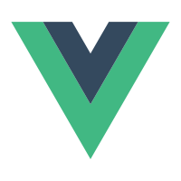
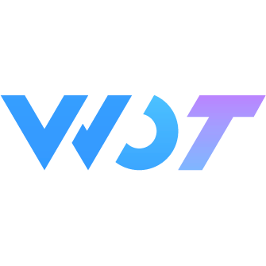
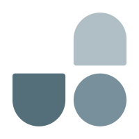

## Cicada-S

- Expertise in Vue technology stack.
- I like interesting and challenging work and exploring different solutions together.
- I like to work with simple our have only one goal - to make the product better.
- "Use own little efforts to change the world"
<!-- - Blog: <a href="https://juejin.cn/user/1957564072600392/posts"><code></code></a><a href="https://blog.csdn.net/South_ink?type=blog"><code></code></a> -->

## Technology stack

<a href="https://v3.cn.vuejs.org"><code></code></a>
<a href="https://uniapp.dcloud.net.cn"><code></code></a>
<a href="https://zh-hans.react.dev/"><code></code></a>
<a href="https://developers.weixin.qq.com/miniprogram/dev/framework/"><code></code></a>
<a href="https://www.tslang.cn"><code></code></a>
<a href="https://nodejs.cn"><code></code></a>
<a href="https://element-plus.org/zh-CN"><code></code></a>
<a href="https://www.naiveui.com/zh-CN"><code></code></a>
<a href="https://wot-design-uni.netlify.app/"><code></code></a>
<a href="https://uview-plus.jiangruyi.com/"><code></code></a>
<a href="https://vant.pro/vant/#/zh-CN"><code></code></a>
<a href="https://webpack.js.org"><code></code></a>
<a href="https://cn.vitejs.dev"><code></code></a>
<a href="https://pinia.vuejs.org/zh"><code></code></a>
<a href="https://unocss.jiangruyi.com/"><code></code></a>
<a href="http://lesscss.cn"><code></code></a>
<a href="https://sass-lang.com"><code></code></a>

## CodeTime

<!-- ## Github Activity -->

<!--  -->